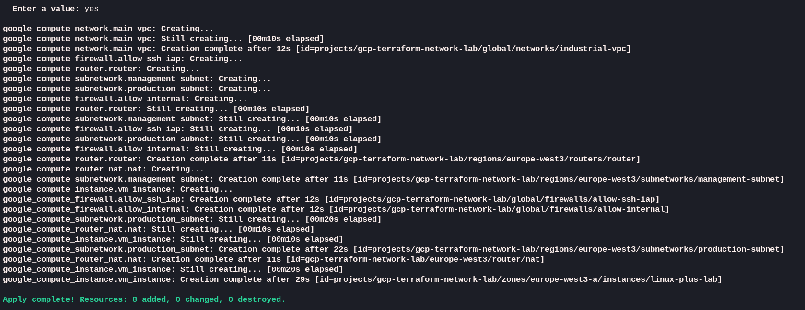
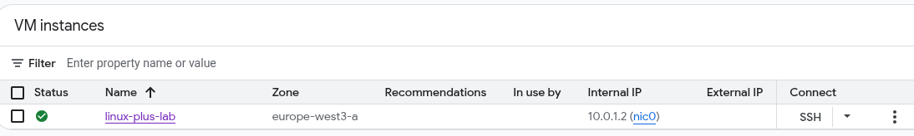
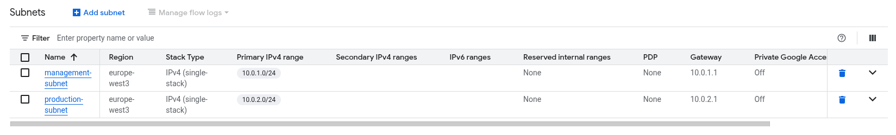
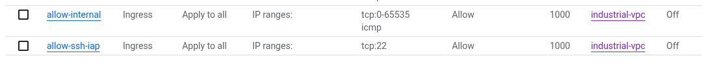
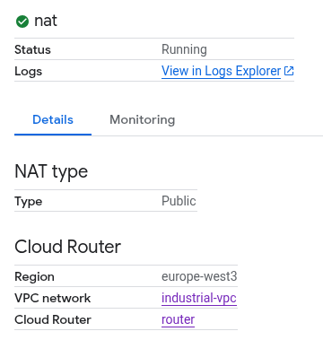
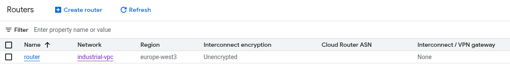

# Automated Secure GCP Network Lab

This project demonstrates the automated deployment of a secure and segmented network infrastructure on Google Cloud Platform (GCP). It is designed to showcase modern security principles such as Zero Trust and controlled egress traffic.

## Core Features

- **Infrastructure as Code (IaC):** Full automation using **Terraform** to ensure consistency and stability.
- **Network Segmentation:** Separation of management and production subnets to reduce the attack surface.
- **Zero Trust Access:** Implementation of **Identity-Aware Proxy (IAP)** for secure SSH access without public IP addresses or open ports.
- **Egress Management:** Utilization of **Cloud NAT** so private instances can securely download updates without being accessible from the internet.
- **Automated Configuration:** Use of **Bash startup scripts** for automatic system hardening and service installation (Nginx, monitoring tools).

## Architecture

The setup consists of:
1. A customized **VPC** (industrial-vpc).
2. Two isolated **subnets** (Management and Production).
3. A **Cloud Router** and **Cloud NAT** for secure outbound traffic.
4. Specific **Firewall Rules** that strictly limit access to Google's IAP range.

## Technologies
- **Cloud:** Google Cloud Platform (GCP)
- **IaC:** Terraform
- **Scripting:** Bash
- **Security:** Identity-Aware Proxy (IAP), Firewall Rules, Cloud NAT

---

## Installation and Deployment

### 1. Prerequisites
Ensure the following components are installed and configured:
* **Terraform**: Download the latest version from `https://developer.hashicorp.com/terraform/install`.
* **Google Cloud SDK (gcloud CLI)**: Follow the instructions at `https://docs.cloud.google.com/sdk/docs/install-sdk`.
* **GCP Project**: An active Google Cloud Project ID with billing enabled is required.

### 2. Authentication
Before running Terraform, you must authenticate your CLI with your Google Cloud account. In the terminal run:

`gcloud auth application-default login`.

### 3. Deployment Steps
Steps to build the infrastructure:

- Clone the repository and change to the lab directory:
  
`git clone https://github.com/kruno-kartus/gcp-terraform-network-lab.git
cd gcp-terraform-network-lab`

- Initialize Terraform:
  
`terraform init`

- Plan and verify infrastructure:
  
`terraform plan`

- Deploy the infrastructure. This will create resources in GCP:
  
`terraform apply`

If everything was ok, the end of deployment ends with the Apply complete! message: 

## Check the resources in GCP console:

- navigate and login to your account `https://console.cloud.google.com/`

### In menu select Compute Engine -> VM Instances:

### In menu select VPC Network -> VPC Networks:

### In menu select VPC Network -> Firewall:

### In menu select Network Services -> Cloud NAT:

### Find the router and click on it:

## Cleanup: To avoid unnecessary costs, you can remove the entire infrastructure with the following command:

`terraform destroy`

